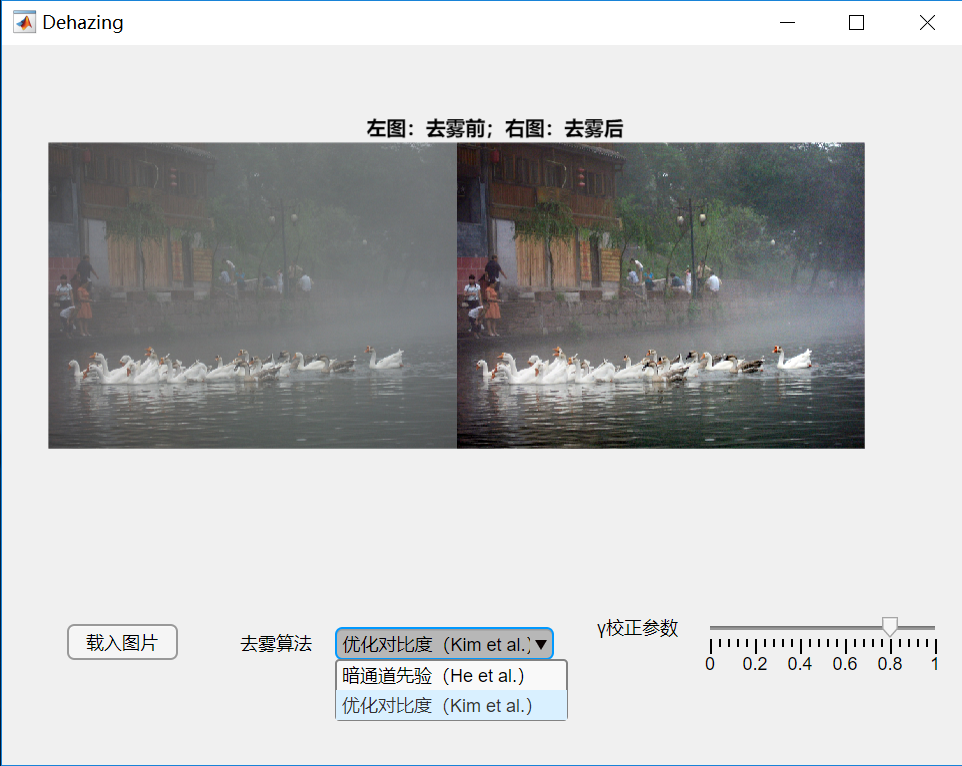

# 图像去雾

> 作者：赵文亮
>
> 班级：自64
>
> 学号：2016011452
>

## 运行环境

- Windows 10 x64
- MATLAB R2018b
- GUI由MATLAB App designer 编写

## 运行方式

### 打开程序

- 在`app`文件夹下，双击`Dehazing.mlapp`
- 或者在MATLAB中，切换到`app`目录下，命令行中输入`Dehazing`

程序初始界面如图：

### 图像去雾

- 下拉菜单选择去雾算法：暗通道先验/优化对比度
- 拖动滑条改变Gamma校正参数
- 点击`载入图片`可以改变输入图片

## 目录结构

- src/：源代码
  - *_He.m：He et al. 算法相关代码
  - *_Kim：Kim et al. 算法相关代码
  - fastguidedfilter_color.m和boxfilter.m为引导滤波相关代码，由两种算法共用
  - main.m：读取dataset/文件夹下所有图像，将去雾结果输出到results/文件夹下。
- dataset/：输入图像
- results/：去雾结果
  - *_He.jpg：He et al. 去雾结果
  - *_Kim.jpg：Kim et al. 去雾结果
- app/：图形界面文件`Dehazing.mlapp`
- report.pdf：报告
